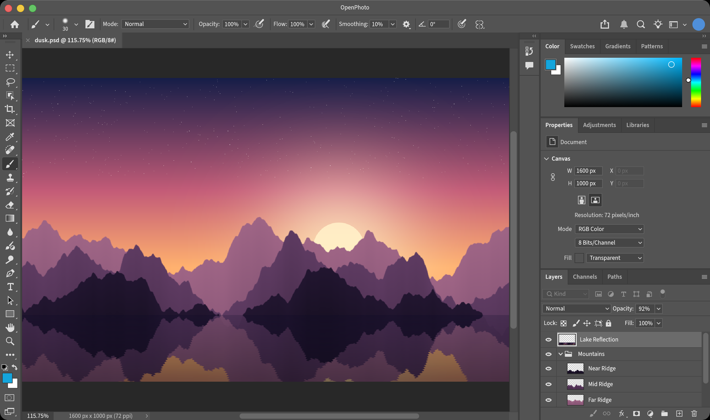
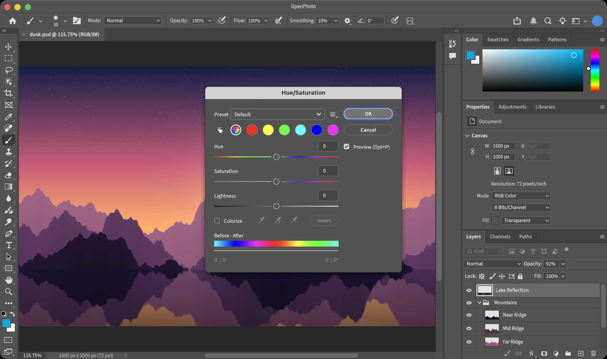
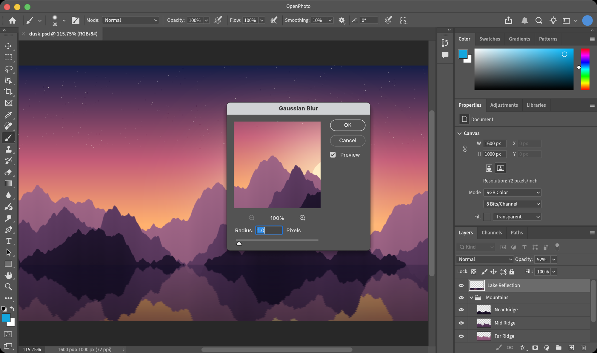
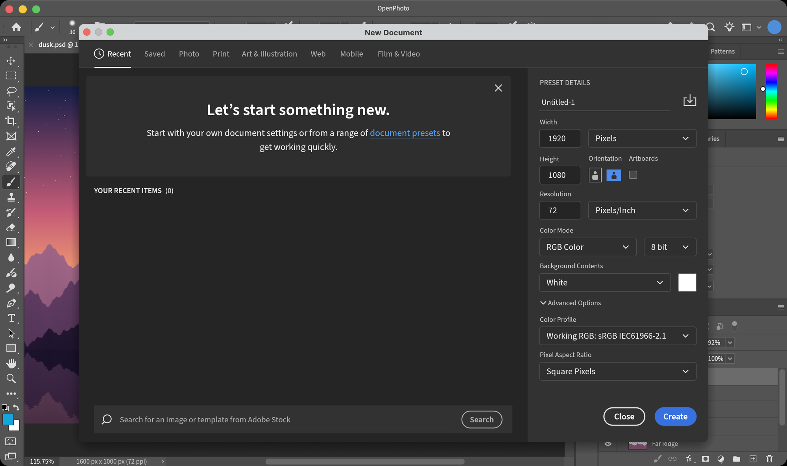

<div align="center">

# OpenPhoto

**An open-source image editor that works the way Photoshop does — written in Rust.**

The same layout, menus, shortcuts and dialogs as Photoshop 2026, measured point by point,<br>
with image algorithms calibrated against Photoshop's own output.

[](#license)
[](rust-toolchain.toml)
[](#getting-started)
[](#roadmap)

English · [简体中文](README.zh-CN.md)



</div>

## Why OpenPhoto

Millions of people have years of Photoshop in their hands: where every panel is, what every shortcut does, how each dialog responds. OpenPhoto aims to be a free editor where all of that carries over unchanged.

- **Pixel-faithful interface.** Windows, panels, option bars and dialogs are measured from a running Photoshop 2026 at 1:1 and compared side by side, down to field sizes, slider scales and font tracking.
- **Your muscle memory works.** Menus, item order and default shortcuts match Photoshop. Dialogs remember what Photoshop remembers and forget what it forgets.
- **Calibrated algorithms.** Adjustments and filters are fitted to Photoshop's own output using probe images: kernel by kernel, lookup table by lookup table. Fixtures captured from Photoshop are checked into the repository and tested on every change.
- **Native and fast.** Pure Rust with a GPU-composited canvas (wgpu), tiled copy-on-write pixel storage and no runtime dependencies.

<div align="center">

<br><sub>The Curves dialog: Photoshop 2026 on the left, OpenPhoto on the right.</sub>
</div>

## Features

> OpenPhoto is in early development. What is listed here works today; [the roadmap](#roadmap) covers what is still missing.

**Interface**
- Every tool's options bar, the toolbar icons, the Properties panel and the dialogs laid out at positions measured on Photoshop 2026, most within 1 pt
- Photoshop 2026's New Document dialog with its preset categories, recent and saved presets

**Documents and files**
- Opens and saves layered **PSD** files (layers, groups, blend modes, opacity and fill, masks, locks, links, color labels), checked field by field against files saved by Photoshop
- Opens PNG, JPEG, WebP, TIFF, BMP and GIF; exports PNG and JPEG
- Tabbed documents, unlimited undo with a History panel, drag and drop to open

**Layers**
- All 27 Photoshop blend modes, opacity and fill opacity, layer groups with pass-through
- Layer masks, five kinds of locks, linking, color labels, merging and flattening
- Multi-selection, drag to reorder, align and distribute

**Selection and transformation**
- Rectangular, elliptical, single-row and single-column marquees, lasso, polygonal lasso and magic wand
- Select › Modify (border, smooth, expand, contract, feather), Transform Selection
- Free Transform with skew, distort, perspective and warp; Image Size, Canvas Size, rotation, Crop with Photoshop's overlays and straightening

**Painting and retouching**
- Brush, pencil, eraser, gradient, paint bucket, clone stamp and history brush
- Blur, sharpen, dodge, burn and sponge; shapes and type; eyedropper with Photoshop's Color Picker

**Adjustments** — every dialog rebuilt after Photoshop 2026

Levels · Curves · Brightness/Contrast · Exposure · Vibrance · Hue/Saturation · Color Balance · Black & White · Photo Filter · Channel Mixer · Selective Color · Gradient Map · Threshold · Posterize · Invert · Desaturate · Equalize · Auto Tone / Contrast / Color

**Filters** — matched to Photoshop's output, most within one level

Gaussian Blur · Box Blur · Surface Blur · Motion Blur · Blur / Blur More · Unsharp Mask · Sharpen / More / Edges · Add Noise · Despeckle · Dust & Scratches · Median · Minimum · Maximum · High Pass · Offset · Custom · Mosaic · Fragment · Twirl · Pinch · Spherize · Polar Coordinates · Emboss · Find Edges · Solarize · Trace Contour · Wind

<table>
  <tr>
    <td width="50%"></td>
    <td width="50%"></td>
  </tr>
  <tr>
    <td align="center"><sub>Hue/Saturation</sub></td>
    <td align="center"><sub>Gaussian Blur, with its live preview</sub></td>
  </tr>
  <tr>
    <td colspan="2"></td>
  </tr>
  <tr>
    <td colspan="2" align="center"><sub>New Document</sub></td>
  </tr>
</table>

## Getting started

**Download** the signed and notarized app for macOS 11 or later (Apple Silicon and Intel) from [Releases](https://github.com/yuanzhixiang/openphoto/releases/latest).

To build from source (OpenPhoto is developed and tested on macOS, where it uses the native menu bar):

```bash
git clone https://github.com/yuanzhixiang/openphoto.git
cd openphoto
cargo run --release -- path/to/image.psd
```

The Rust toolchain is pinned in `rust-toolchain.toml` and installed automatically by rustup. Without a file argument, OpenPhoto opens a blank document. Files can also be dropped onto the window.

### Shortcuts

The default Photoshop shortcuts apply. A few of the most used:

| Action | Shortcut |
|---|---|
| New · Open · Save · Save As | ⌘N · ⌘O · ⌘S · ⇧⌘S |
| Undo · Redo · Toggle last state | ⌘Z · ⇧⌘Z · ⌥⌘Z |
| Free Transform | ⌘T |
| Levels · Curves · Hue/Saturation | ⌘L · ⌘M · ⌘U |
| New layer · Group · Merge down | ⇧⌘N · ⌘G · ⌘E |
| Zoom in · Zoom out · Fit · 100% | ⌘= · ⌘- · ⌘0 · ⌘1 |
| Tools | V M L W C I B S Y E G O T U H Z |
| Default colors · Swap colors | D · X |

## Architecture

OpenPhoto is a Cargo workspace. The document model knows nothing about the interface, so every editing operation can be tested without a window.

| Crate | Responsibility |
|---|---|
| [`op-core`](crates/op-core) | Document model: layer tree, 256×256 tiled copy-on-write pixels, blend modes, selections, history, adjustments, filters, transforms, painting |
| [`op-render`](crates/op-render) | wgpu canvas: zoom, mipmaps, checkerboard and pixel grid, embedded in egui through paint callbacks |
| [`op-io`](crates/op-io) | File I/O: a dependency-free PSD reader and writer, plus bitmap formats through `image` |
| [`op-color`](crates/op-color) | Color models and conversions |
| [`op-tools`](crates/op-tools) | Tool definitions and their shortcuts |
| [`op-ui`](crates/op-ui) | The egui interface: menus, option bar, toolbar, panels, dialogs and tool interaction |
| [`op-mcp`](crates/op-mcp) | MCP server: every editing operation behind keyword search, over stdio |
| [`app`](app) | The executable |

## MCP server

Agents can edit images through [`op-mcp`](crates/op-mcp), an MCP server speaking JSON-RPC 2.0 over stdio. It calls the same `op-core` / `op-io` functions as the interface, so results match the application exactly.

```bash
cargo run -p op-mcp
```

Instead of exposing every operation as its own tool, the server exposes exactly two:

| Tool | Purpose |
|---|---|
| `search_tools` | Keyword search over ~100 operations (adjustments, filters, layers, selections, canvas, painting, history); returns matching names with their full input schemas |
| `call_tool` | Run one operation by name with arguments |

The workflow is discover-then-run: `search_tools` with `{"query": "gaussian blur"}` returns `filter_gaussian_blur` with its schema, and `call_tool` with `{"name": "filter_gaussian_blur", "arguments": {"radius": 2.0}}` applies it. Documents stay open in the server between calls: `open_image` or `new_document` first, then edit, then `export_composite` or `save_image` (`.psd` keeps the layers). `cargo test -p op-mcp` covers search scoring and an edit round-trip through the protocol.

```json
{ "mcpServers": { "openphoto": { "command": "cargo", "args": ["run", "--quiet", "-p", "op-mcp"] } } }
```

## Testing

```bash
cargo test --workspace
```

About 350 tests guard both halves of the goal:

- **Photoshop parity.** Fixtures in [`crates/op-core/fixtures`](crates/op-core/fixtures) hold Photoshop 2026's output for a probe image under each adjustment and filter. Tests fail if a result drifts by more than the tolerance it was measured to meet, usually one level.
- **Interface behavior.** UI tests drive the real application headlessly through `egui_kittest`: open a dialog from the menu, type into fields, press Enter, and check the document and its history.

## Roadmap

Major areas that are not there yet, roughly in priority order:

- Pixel calibration of the remaining panels and dialogs
- More tools: brush presets and pressure, healing brushes, quick selection, magnetic lasso
- Remaining adjustments and filters: Shadows/Highlights, Replace Color, Smart Sharpen, Render, Distort
- Editable type and vector shapes, layer styles, adjustment and fill layers
- Channels and Paths panels, snapping, smart guides
- Color modes beyond 8-bit RGB, ICC color management
- Smart objects, actions and automation

## Contributing

Issues and pull requests are welcome. The guiding rule for any change is simple: **a running Photoshop 2026 is the reference.** If OpenPhoto looks or behaves differently from it, that is a bug. Please run `cargo fmt`, `cargo clippy --workspace --all-targets` and `cargo test --workspace` before sending a pull request, and add a test for any behavior you change.

## License

Licensed under either of

- Apache License, Version 2.0 ([LICENSE-APACHE](LICENSE-APACHE))
- MIT license ([LICENSE-MIT](LICENSE-MIT))

at your option.

Third-party assets: the interface font is [Source Sans 3](https://github.com/adobe-fonts/source-sans) (SIL Open Font License, see [`OFL.txt`](crates/op-ui/assets/fonts/OFL.txt)); icons come from [Phosphor Icons](https://phosphoricons.com) (MIT).

<sub>OpenPhoto is an independent project. It is not affiliated with, endorsed by or sponsored by Adobe Inc. Adobe and Photoshop are trademarks of Adobe Inc., used here only to describe compatibility.</sub>
